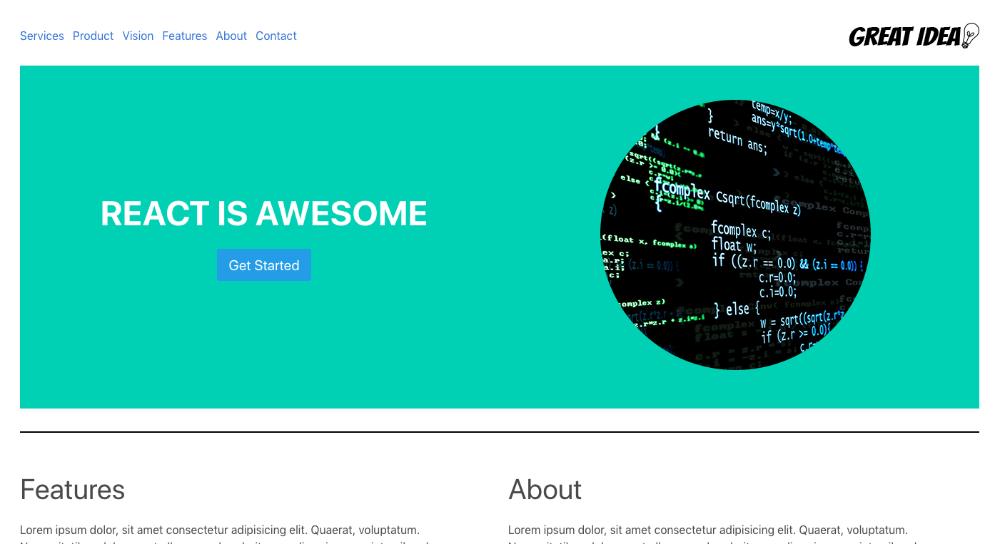

# A Fictional Landing Page using React

### About

This is a demonstration landing page using a previous challenge (DOM-I) but using React JS.

### Installation

The entire web pages source files are in the _.src_ directory. It can be forked or cloned.

### Technology Used

1.  React JS
2.  Bulma CSS
3.  Parcel Bundler
